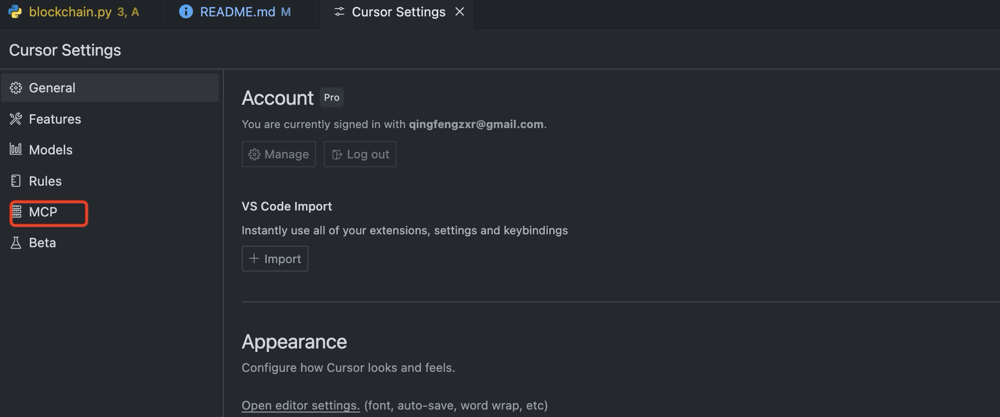
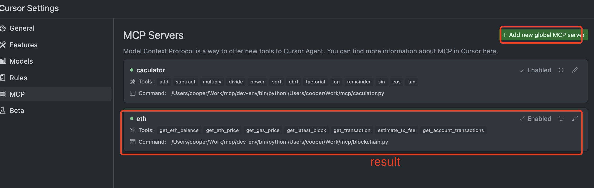
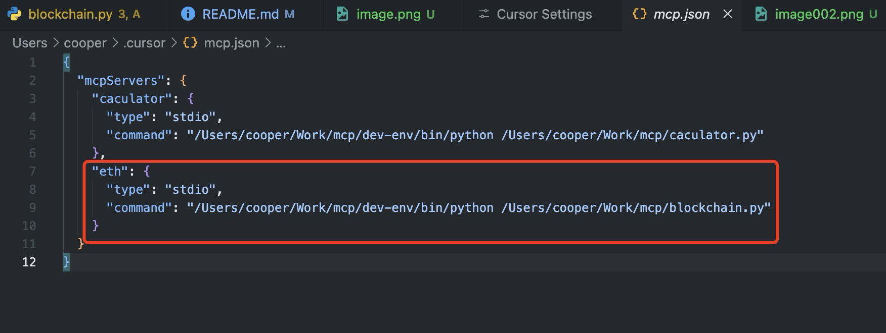

# eth-mcp-server
An ETH-obsessed MCP Server, where the creator is still pondering its ultimate usage. For now, it's just for fun!

## About MCP

The Model Context Protocol (MCP) allows AI models to access real-time data and perform actions through standardized tools and resources. This implementation provides Ethereum blockchain capabilities to AI assistants through the MCP framework.

## Features
Now is support tools & resources

- Get ETH balance for any Ethereum address
- Check current Ethereum price in USD
- Get current gas prices on the Ethereum network
- Retrieve latest block information
- View transaction details
- Estimate transaction fees
- Query account transaction history

## Requirements

- Python 3.7+
- web3.py
- requests
- mcp.server.fastmcp

## Setup

1. Clone the repository
2. Install required dependencies:
   ```shell
   pip install web3 requests
   ```
3. Replace the Etherscan API key in the code with your own:
   ```python
   ETHERSCAN_API_KEY = "YOUR_API_KEY_HERE"
   ```

### Available Tools

- `get_eth_balance(address)` - Get the ETH balance of an address
- `get_eth_price()` - Get current Ethereum price in USD
- `get_gas_price()` - Get current Ethereum network gas price
- `get_latest_block()` - Get latest block information
- `get_transaction(tx_hash)` - Get transaction details
- `estimate_tx_fee(gas_amount)` - Estimate transaction fee
- `get_account_transactions(address, page, offset)` - Get account transaction history

### Available Resources

- `ethereum://price` - Ethereum price information
- `ethereum://stats` - Ethereum network statistics
- `ethereum://address/{address}` - Address information
- `ethereum://address/{address}/transactions` - Address transaction history

## API Endpoints

The service uses the following external APIs:
- Ethereum JSON-RPC API via LlamaRPC
- CoinGecko API for ETH price
- Etherscan API for transaction history

## How to setup with cursor
1. open cursor mcp setting


2. click `Add new Global mcp server` button


3. set config like this, please replace the path with you own path


```json
{
  "mcpServers": {
    "eth": {
      "type": "stdio",
      "command": "/path/to/python /path/to/blockchain.py"
    }
  }
}
```

4. Once you have successfully set up, you can retrieve ETH information in Cursor by using chat.

